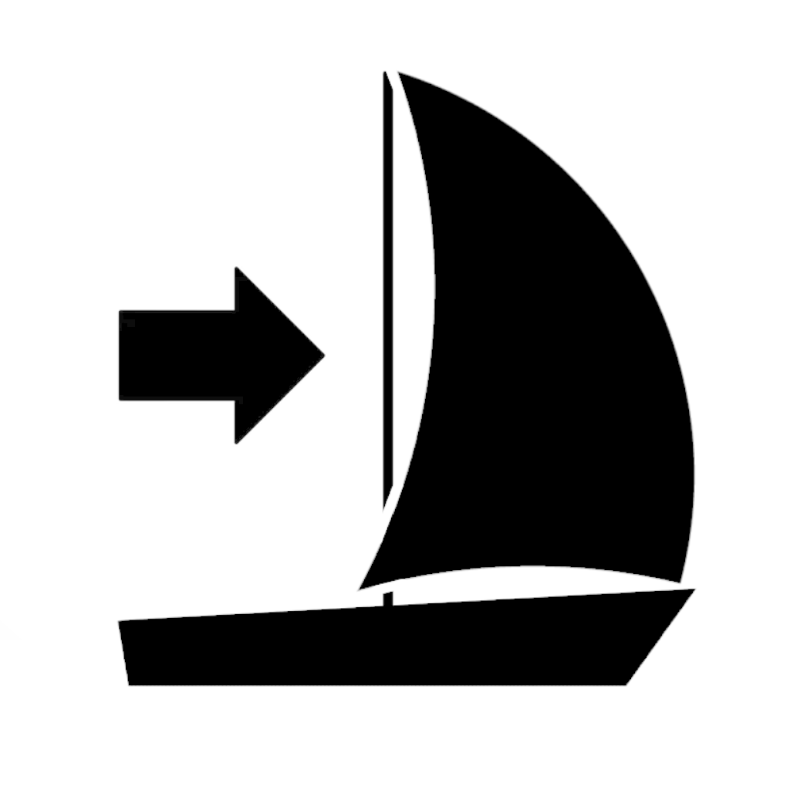
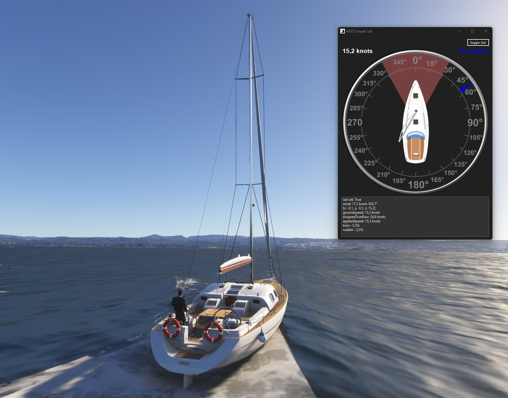

# MSFS Sailing Physics Tool

A custom sail physics simulation for Microsoft Flight Simulator 2020/2024, allowing boats to sail realistically according to wind direction and strength — instead of behaving like motorboats.

---

## 🧭 Intention

Microsoft Flight Simulator features a few drivable boats, but they do not behave like real sailing vessels. They move regardless of wind and lack realistic sail physics. This tool aims to fix that.

**Goal:** Bring authentic sailboat behavior to MSFS using real-time SimConnect data, enabling:

- Wind-aware sailing with upwind and downwind performance
- Dynamic boom and jib simulation
- A learning tool for basic sailing principles in the simulator

---

## 🛠️ Approach / Architecture

The project is a lightweight `.NET` Windows Forms application that connects to MSFS using **SimConnect**.

### Key Components

- **SimConnect Integration**: Retrieves wind, heading, and velocity data
- **Custom Sail Model**: Calculates effective speed based on relative wind angle and strength
- **Boom & Jib Logic**: Simulates sail deflection depending on the point of sail
- **Live Visualization**: Compass rose with wind direction, boat speed, boom, and jib angles
- **Track Mode**: Optional logic to apply only when sail physics are enabled and the user isn't manually controlling throttle

### Coefficient Table (Sail Efficiency)

The sail model uses a table of angle-based efficiency coefficients (simplified polar diagram) to estimate propulsion effectiveness:

| Relative Wind Angle (°) | Sail Efficiency | Boom Deflection | Jib Deflection | Point of Sail        |
|-------------------------|------------------|------------------|----------------|-----------------------|
| 0–10                    | 0.00             | 0°               | 0°             | In Irons              |
| 10–35                   | 0.0 → 0.6        | 0° → 10°         | 0° → 15°       | Close Hauled          |
| 35–50                   | 0.6 → 0.85       | 10° → 25°        | 15°            | Close Reach           |
| 50–75                   | 0.85 → 1.0       | 25° → 45°        | 15°            | Beam Reach            |
| 75–110                  | 1.0 → 0.85       | 45° → 60°        | 30°            | Broad Reach           |
| 110–135                 | 0.85 → 0.7       | 60° → 70°        | 30°            | Broad Reach           |
| 135–160                 | 0.7 → 0.55       | 70° → 85°        | 30°            | Running               |
| 160+                    | 0.55             | 85°              | -45° (depowered) | Dead Run / Wing-on-Wing |

---

## ▶️ Usage

### Requirements

- Microsoft Flight Simulator 2020 or 2024
- .NET 9 Runtime (or newer)
- A sail-capable boat in MSFS (e.g., from the community)

### Recommended Boats

- [Yacht and Sailboat Pack (5 boats)](https://store.flightsim.to/product/yatch-and-sailboat-pack-5-boats)
- [Yacht and Fishing Boat Pack](https://store.flightsim.to/product/yatch-and-fishing-boat-pack)
- [45ft Lagoon Catamaran](https://store.flightsim.to/product/45ft-lagoon-catamaran)

### Setup

1. Launch MSFS and load into a drivable boat
2. Start this app — it will automatically connect via SimConnect
3. Observe wind direction and sail deflection in the UI
4. Steer the boat and experience realistic speed variations based on wind angle

---

## ⚠️ Bugs / Limitations

- No differentiation between boat types (small, large, historical, catamarans)
- Wind acceleration must be paused during manual steering
- Sail physics are simplified for gameplay purposes
- MSFS aircraft fuselage aerodynamics can cause boats to drift into the wind
- Boat may stall when pointing directly into the wind (“in irons”)

---

## 🔮 Planned Features

- [ ] **Realistic sail physics**  
      Incorporate lift/drag forces and apparent wind calculations for more accurate behavior  
- [ ] **Selectable simulation modes**  
      Toggle between simplified and physics-based sail behavior for beginners and advanced users  
- [ ] **User control of sails**  
  - Main sail trim (boom angle)  
  - Jib sheet (jib deflection)  
  - Sail reefing/furling  
  - Spinnaker deployment and control for downwind sailing  
- [ ] **Sail dynamics**  
  - Luffing and collapse when improperly trimmed  
  - Depowering when blanketed or oversheeted  
- [ ] **UI enhancements**  
  - In-app panel for manual sail adjustments  
  - Visual feedback on point of sail, sail efficiency, and apparent wind  
- [ ] **SimConnect control mapping**  
  - Use aircraft controls (elevator trim, spoilers, etc.) to adjust sails in real time  
- [ ] **Spinnaker support**  
  - Deployable for dead run or broad reach  
  - Additional speed boost and unique handling  

---

## 👋 Contributing

If you're into sailing, SimConnect, or MSFS modding, contributions are welcome! Open an issue or a pull request.

Any knowledge and input regarding **sailing physics** or **real-world sailing practices** is highly appreciated.

---

## 📜 License

MIT License

Copyright (c) 2025 Cedric Pump

Permission is hereby granted, free of charge, to any person obtaining a copy  
of this software and associated documentation files (the “Software”), to deal  
in the Software without restriction, including without limitation the rights  
to use, copy, modify, merge, publish, distribute, sublicense, and/or sell  
copies of the Software, and to permit persons to whom the Software is  
furnished to do so, subject to the following conditions:

The above copyright notice and this permission notice shall be included in all  
copies or substantial portions of the Software.

THE SOFTWARE IS PROVIDED “AS IS”, WITHOUT WARRANTY OF ANY KIND, EXPRESS OR  
IMPLIED, INCLUDING BUT NOT LIMITED TO THE WARRANTIES OF MERCHANTABILITY,  
FITNESS FOR A PARTICULAR PURPOSE AND NONINFRINGEMENT. IN NO EVENT SHALL THE  
AUTHORS OR COPYRIGHT HOLDERS BE LIABLE FOR ANY CLAIM, DAMAGES OR OTHER  
LIABILITY, WHETHER IN AN ACTION OF CONTRACT, TORT OR OTHERWISE, ARISING FROM,  
OUT OF OR IN CONNECTION WITH THE SOFTWARE OR THE USE OR OTHER DEALINGS IN THE  
SOFTWARE.
